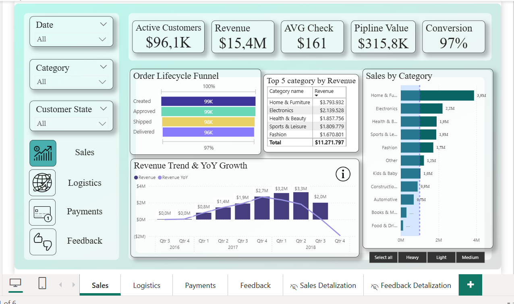
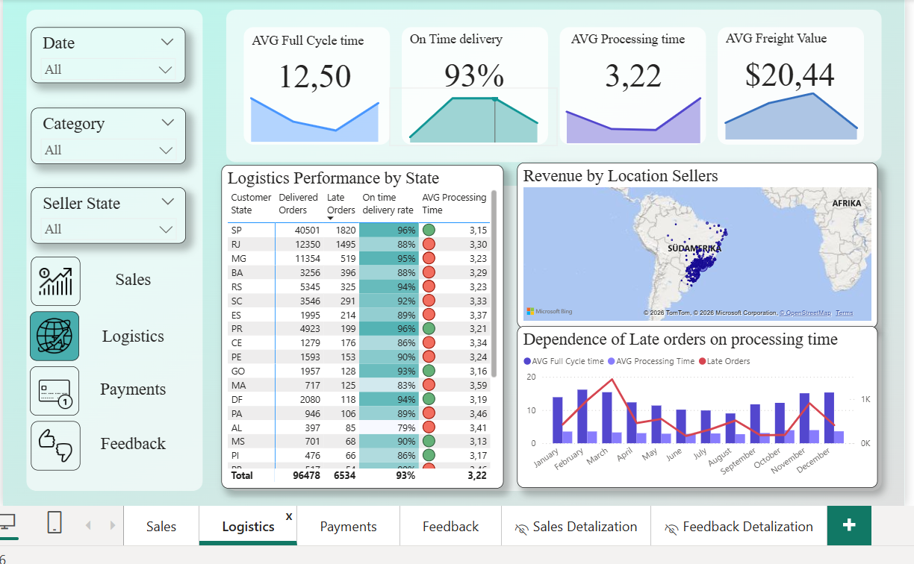
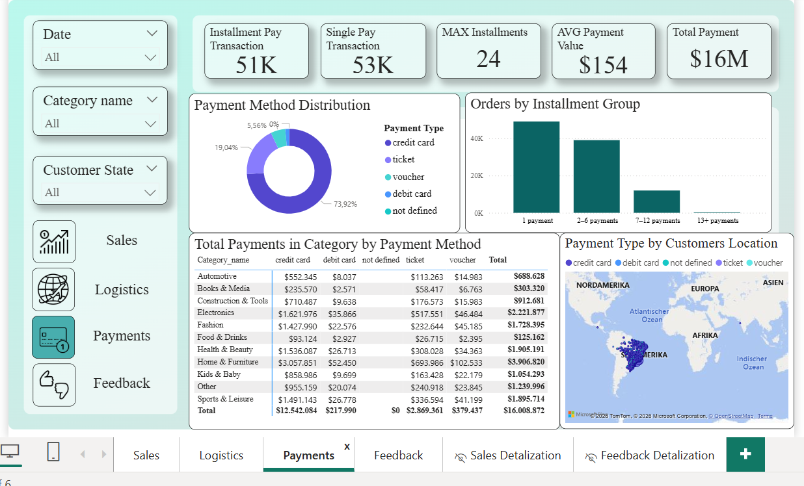
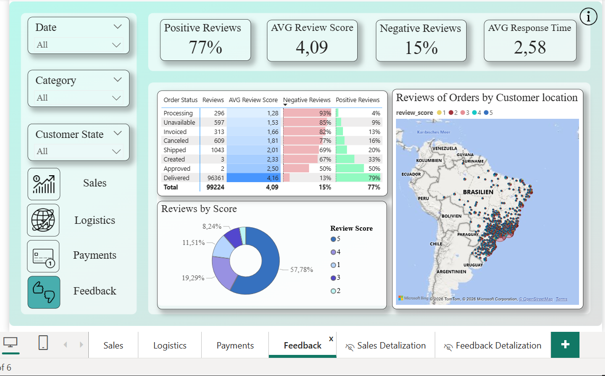
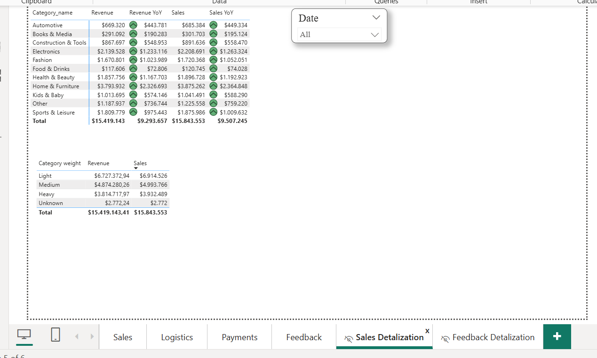
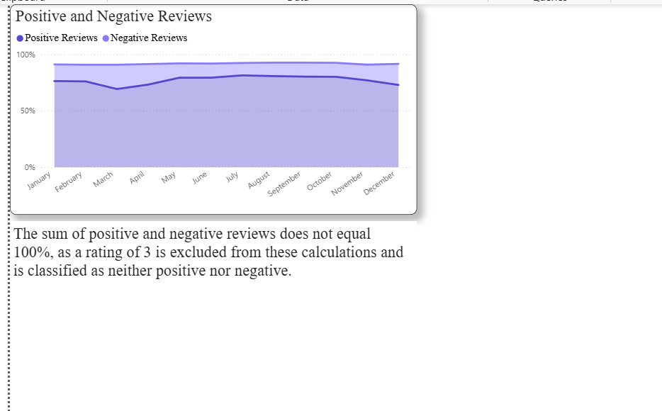

# E-commerce Sales, Logistics & Customer Feedback Analysis | Power BI

I analyzed an e-commerce dataset covering sales, logistics, payments, and customer reviews. The data was loaded and transformed in Power Query, then I built a relational data model, created DAX measures, and designed interactive dashboards to analyze the full order lifecycle — from order creation to delivery and customer feedback.

## 🎯 Business Goal

The dashboard was built to answer key business questions:

* How is revenue trending, and which product categories drive the most sales?
* How efficient is the delivery process, and where do delays occur?
* What payment methods and installment patterns do customers use?
* How satisfied are customers, and how does that relate to delivery performance?

## 📊 Dashboard Overview

### 💰 Sales
KPI cards (Active Customers, Revenue, AVG Check, Pipeline Value, Conversion), order lifecycle funnel (Created → Approved → Shipped → Delivered), top 5 categories by revenue, sales by category, revenue trend with YoY growth.

Filters: Date • Category • Customer State

### 🚚 Logistics
KPI cards (AVG Full Cycle Time, On Time Delivery, AVG Processing Time, AVG Freight Value), logistics performance by state, seller revenue map, correlation between processing time and late orders.

Filters: Date • Category • Seller State

### 💳 Payments
KPI cards (Installment Pay Transactions, Single Pay Transactions, Max Installments, AVG Payment Value, Total Payment), payment method distribution, orders by installment group, payments by category and method, payment type by customer location (map).

Filters: Date • Category • Customer State

### ⭐ Feedback
KPI cards (Positive Reviews, AVG Review Score, Negative Reviews, AVG Response Time), reviews breakdown by order status, reviews by score, reviews by customer location (map).

Filters: Date • Category • Customer State

### 🔎 Sales Detalization
Detailed pivot table breakdown of revenue and sales by category, including YoY comparison and category weight (Light / Medium / Heavy / Unknown).

### 🔎 Feedback Detalization
Positive vs. negative review trend over the year.

*Note: the sum of positive and negative reviews does not equal 100%, as a rating of 3 is excluded from these calculations and classified as neither positive nor negative.*

## ⚙️ Technical Highlights

* Data loading and transformation in Power Query
* Relational Power BI data model (customers, orders, order_items, order_payments, order_reviews, products, sellers)
* Custom calendar table
* DAX measures for KPIs: conversion rate, cycle time, on-time delivery rate, review sentiment, YoY growth
* Interactive maps and cross-filtering across 6 report pages

## 💡 Key Insights

* The business has a very high order conversion rate (97%).
* Revenue is driven by a few main product categories.
* A significant share of orders is paid in installments, which slows down cash flow.
* Late deliveries are mostly related to logistics and regional delivery issues.
* Delivery delays strongly affect negative customer reviews.
* Some negative reviews are related to packaging and order fulfillment issues.

## 🚀 What I Learned

This project helped me better understand how sales, logistics, payments, and customer satisfaction are connected, and how dashboards can help identify business problems across the full order lifecycle.

I'd be happy if you explored the dashboard and shared your feedback.

## 📂 Project Files

* [Power BI Dashboard (.pbix)](Fesenko Project.pbix)
